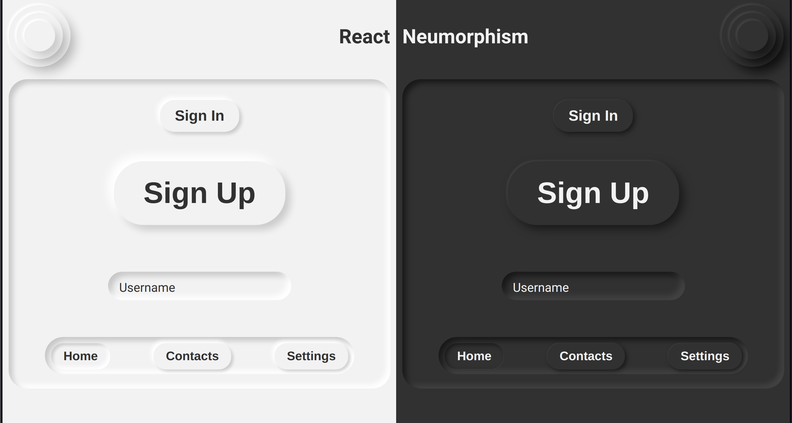

# react-neumorphism

> A neumorphism React component library

[](https://www.npmjs.com/package/react-neumorphism) [](https://standardjs.com)

## Install

```bash
npm install --save react-neumorphism
```

## Usage

```jsx
import React, { Component } from 'react'

import Button from 'react-neumorphism'

const App = () => {
  return <Button>Sign Up</Button>
}
```

## Example



## License

MIT © [starlightromero](https://github.com/starlightromero)
